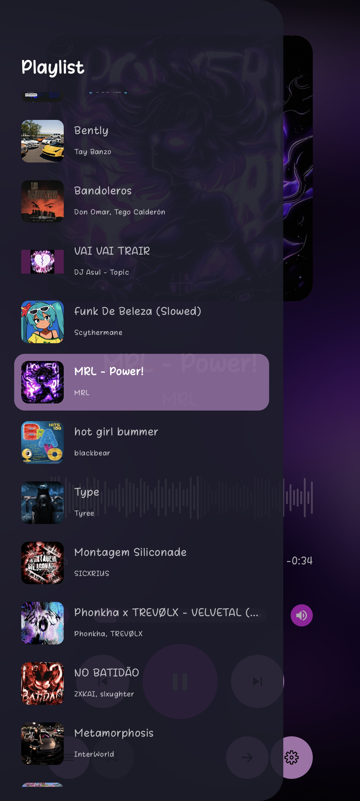
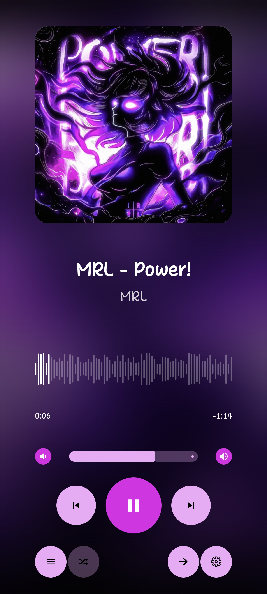

# Amberoid

<p align="center">
  
</p>

**Amberoid** — это супер-минималистичный музыкальный плеер для Android, вдохновлённый эстетикой и простотой десктопного плеера Amberol.

Он создан для тех, кто просто хочет слушать музыку, не отвлекаясь на сложные настройки, выравниватели громкости или создание бесконечных плейлистов.

<p align="center">
  
  
</p>

## ✨ Особенности

* **Абсолютный минимализм:** Интерфейс, который не мешает.
* **Адаптивный дизайн:** Цвета интерфейса подстраиваются под обложку текущего трека (как в оригинале).
* **Ничего лишнего:** Только музыка, плейлист и базовое управление.
* **Полностью открытый исходный код:** Никаких трекеров, аналитики или рекламы.

## 🤝 Атрибуция и вдохновение

Этот проект является независимой реализацией идей дизайна плеера **Amberol** для платформы Android.

Я выражаю огромную благодарность **Emmanuele Bassi**, автору оригинального Amberol, за создание столь чистого и вдохновляющего интерфейса. Amberoid стремится перенести этот опыт на мобильные устройства, сохраняя верность духу оригинала.

*Оригинальный Amberol (для GNOME):* [https://gitlab.gnome.org/World/amberol](https://gitlab.gnome.org/World/amberol)

## 📥 Скачать

Готовые сборки приложения можно найти в разделе **Releases**:

Последняя версия:

[](https://github.com/PavloVoiat/Amberoid/releases/download/v1.0/app-release.apk)

Если вы хотите скачать другие версии:

1. Перейдите в раздел [Releases](https://github.com/PavloVoiat/Amberoid/releases/).
2. Скачайте файл **`app-release.apk`** (или `amberoid.apk`).
3. Установите его на устройство и пользуйтесь!

## 🛠 Сборка из исходников

Для сборки вам понадобятся только **Git** и **JDK 17** (или новее). Устанавливать Android Studio не требуется.

1. Клонируйте репозиторий:
   ```bash
   git clone https://github.com/ТВОЙ_ЛОГИН/amberoid.git
   cd amberoid
   ```

2. Соберите APK через Gradle Wrapper:
 - **Linux/macOS:**
   ```bash
   ./gradlew assembleRelease
   ```
 - **Windows (PowerShell/CMD):**
   ```cmd
   gradlew.bat assembleRelease
   ```

Готовый файл `.apk` появится по пути: `app/build/outputs/apk/release/`.

## 📝 История изменений

Все обновления и список изменений проекта доступны в файле [CHANGELOG.md](CHANGELOG.md).

## 📜 Лицензия
Этот проект распространяется под лицензией **GPL-3.0**. Это означает, что вы можете свободно использовать, изучать, изменять и распространять этот софт, при условии сохранения той же лицензии для производных работ. Полный текст лицензии находится в файле `LICENSE.md`.
